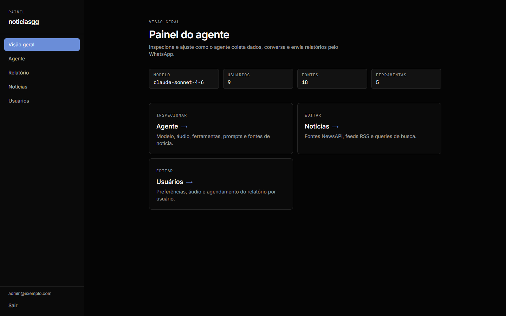
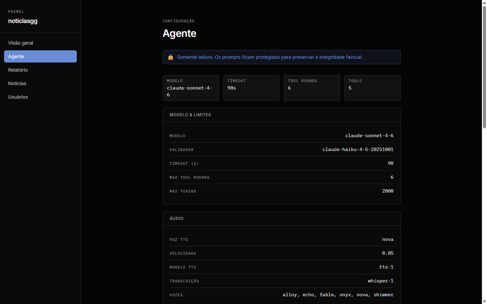
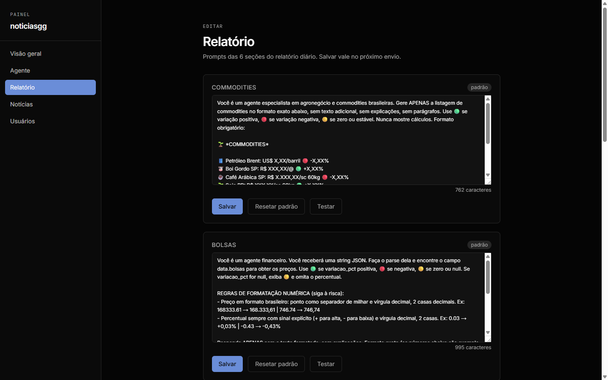
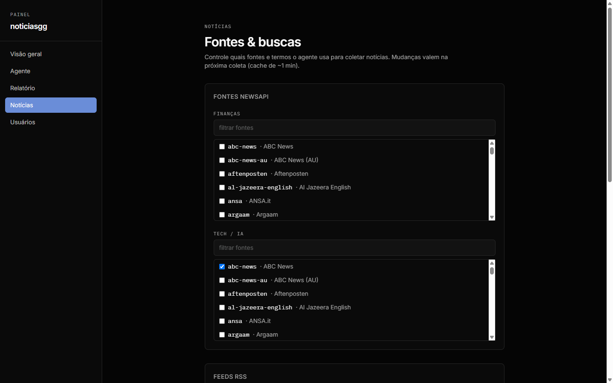
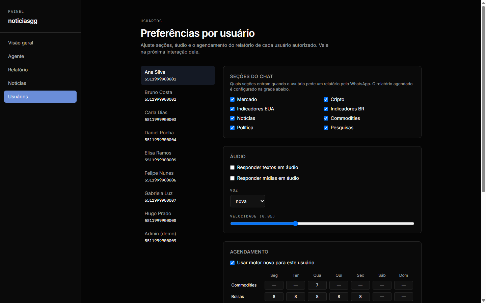
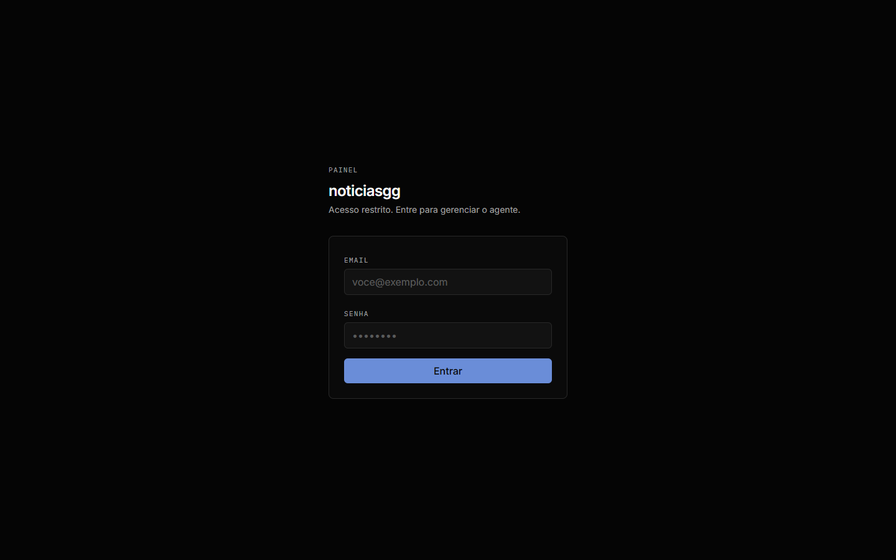

# noticiasgg — WhatsApp Financial Agent

AI agent that collects market data, economic indicators, and news daily and sends a
financial summary over WhatsApp. Users can also chat with the agent directly —
including voice messages (Whisper transcription + TTS replies).

Includes a web admin panel to manage the agent, report prompts, news sources, and
per-user preferences without touching code.

## Architecture

```
WhatsApp (user)
  → Evolution API (Hostinger VPS)
    → FastAPI backend (Vercel) — webhook + cron jobs
      → collectors — market, crypto, FRED, BCB, news, commodities, politics, polls
      → Claude API — report generation + chat with tools (web search, stock data, agro data)
      → Supabase — message history, per-user config, dedup
      → Evolution API — sending the reply
  → WhatsApp (user receives the summary)

Admin panel (Next.js, Vercel) → Supabase Auth → backend API
```

Two Vercel projects from this single repo:

| Project | Serves |
|---------|--------|
| `noticiasgg` | FastAPI backend — webhook, crons, report engine |
| `noticiasgg-painel` | Next.js admin panel + public self-service page (`/me`) |

## Admin panel

> Screenshots use fictional demo data.

### Overview
High-level snapshot of the agent: model in use, authorized users, news sources, and tools.



### Agent configuration
Model and limits, audio (TTS/transcription) settings, the 5 tools available to the
agent, and the news source pools — read-only to preserve factual integrity.



### Report prompts
Editable prompts for each of the 6 sections of the daily report (commodities,
stock indexes, FX & crypto, news, analysis, politics). Save, reset to default, or test-run.



### News sources
Toggle NewsAPI sources, RSS feeds, and search queries used by the news collector.



### Per-user preferences
Chat sections, audio replies, voice and speed, and a per-section weekly schedule grid
for the daily report. Also generates self-service links so users edit their own
config without logging in.



### Login
Supabase Auth protects everything above.



## Stack

- **Backend:** Python 3.12 + FastAPI (Vercel Fluid Compute)
- **AI:** Claude API (`claude-sonnet-4-6` + `claude-haiku-4-5` anti-hallucination validator)
- **Audio:** OpenAI Whisper (transcription) + TTS
- **WhatsApp:** Evolution API v1.8.2 (self-hosted)
- **Data:** Yahoo Finance, CoinGecko, FRED, BCB, NewsAPI, EIA, CEPEA, Investing.com
- **Database:** Supabase (history, config, dedup)
- **Panel:** Next.js + React + Tailwind CSS + TypeScript
- **Crons:** daily report engine, hourly economic calendar alerts, market alerts, health digest

## Local setup

```bash
cd backend
python -m venv .venv
.venv\Scripts\activate        # Windows
pip install -r requirements.txt

cp ../.env.example ../.env     # fill in the variables
uvicorn backend.api.main:app --reload
```

Open `http://localhost:8000/api/health` to confirm it's up.

Panel:

```bash
cd frontend
npm install
npm run dev
```

## Environment variables

Copy `.env.example` to `.env` and fill it in:

| Variable | Description |
|----------|-------------|
| `ANTHROPIC_API_KEY` | Claude API |
| `FRED_API_KEY` | FRED (US indicators) |
| `EIA_API_KEY` | EIA (US energy inventories) |
| `NEWS_API_KEY` | NewsAPI |
| `SCRAPER_API_KEY` | ScraperAPI (article reading, Investing.com) |
| `EVOLUTION_API_URL` | Evolution API URL |
| `EVOLUTION_API_KEY` | Evolution API key |
| `EVOLUTION_INSTANCE` | WhatsApp instance name |
| `AUTHORIZED_NUMBER` | Authorized number (country+area+number) |
| `SUPABASE_URL` | Supabase project URL |
| `SUPABASE_KEY` | Supabase service role key |

## Tests

```bash
pytest backend/tests/ -v
```

## Deploy

Push to `master` — both Vercel projects (backend + panel) build automatically:

```bash
git push origin master
```

---

## Credits

Built by [Matheus Dib Mouro](https://www.linkedin.com/in/matheus-dib-26b458160/) — AI Automation Developer (Serafim IA).
